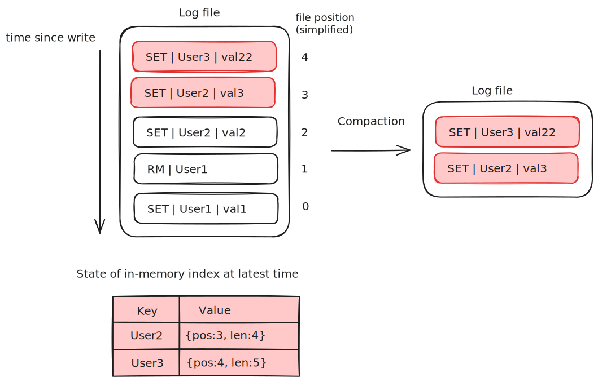

# lskv
Log-structured key-value store

Goals:
- low latency per item read or written
- high throughput, especially when writing an incoming stream of random items
- ability to handle datasets much larger than RAM w/o degradation
- crash friendliness, both in terms of fast recovery and not losing data
- ease of backup and restore
- a relatively simple, understandable (and thus supportable) code structure and data format
- predictable behavior under heavy access load or large volume

Functionality so far:
- Basic get/set/rm 
- Load datastore from disk, populating in-memory index
- Log compaction

